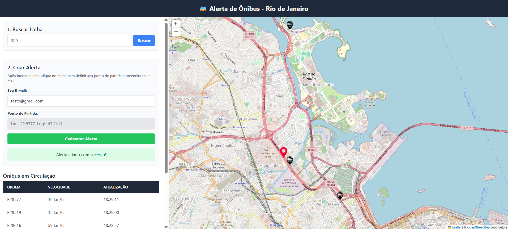
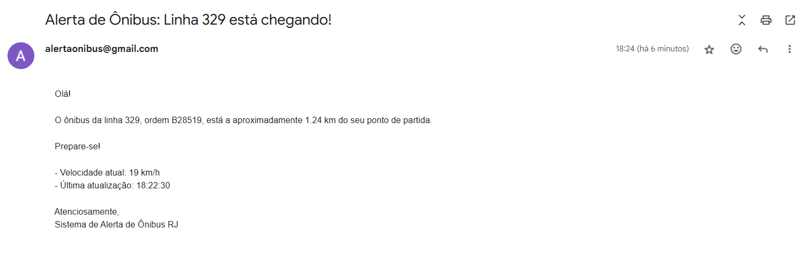

# 🚌 Alerta de Ônibus - Rio de Janeiro

## 📑 Descrição
Este é um **web app** para monitorar posições em tempo real dos ônibus na cidade do Rio de Janeiro.  
Usuários podem cadastrar **alertas personalizados** informando: linha de ônibus, ponto de partida (clicando no mapa) e e-mail.  
Quando um ônibus da linha selecionada fica a **até 1.5 km** do ponto, o sistema envia uma **notificação por e-mail**.

---

## ✨ Funcionalidades
- **Visualização em Tempo Real**: mapa interativo que mostra a posição de todos os ônibus de uma linha pesquisada.  
- **Dados Detalhados**: tabela com número de ordem, velocidade e horário da última atualização de cada ônibus.  
- **Alertas Personalizados**: formulário para cadastrar alerta (linha + ponto no mapa + e-mail).  
- **Notificações por E-mail**: processo em background que checa proximidade e envia e-mails automaticamente.  
- **Sistema Inteligente**:
  - **Cache de Dados** para reduzir carga na API pública.  
  - **Cooldown de Alertas**: evita múltiplos e-mails para o mesmo ônibus — espera **30 minutos** antes de reenviar.  
  - **Persistência de Alertas**: alertas são salvos em ficheiro (arquivo local) para sobreviver a reinícios.

---

## ⚙️ Tecnologias
**Backend**
- FastAPI  
- Celery (tarefas assíncronas)  
- Redis (broker)  
- Geopy (cálculo de distâncias/geolocalização)  

**Frontend**
- React  
- Leaflet.js (mapa)  
- TailwindCSS  
- Axios (requisições HTTP)  

**Containerização**
- Docker (usar para Redis; opcional para outros serviços)

---

## 🚀 Instalação e Execução

### 🔧 Pré-requisitos
- Git  
- Python 3.10+  
- Node.js & npm  
- Docker Desktop (para Redis)  

---

### 1. Clonar o repositório
```bash
git clone https://github.com/Dudu300599/alerta-onibus-rio
cd alerta-onibus-rio
```

---

### 2. Configuração do Backend

#### Navegar para a pasta do backend
```bash
cd backend
```

#### Criar e ativar ambiente virtual
Windows:
```powershell
python -m venv venv
.
env\Scripts ctivate
```

Linux / macOS:
```bash
python -m venv venv
source venv/bin/activate
```

#### Instalar dependências
```bash
pip install -r requirements.txt
```

#### Variáveis de ambiente (arquivo `.env`)
Crie um arquivo chamado `.env` na pasta `backend` com (exemplo):

```env
# Credenciais de e-mail (Gmail: usar Senha de App)
EMAIL_HOST_USER="seu_email_aqui@gmail.com"
EMAIL_HOST_PASSWORD="sua_senha_de_app_de_16_digitos"

# (Opcional) URL do Redis se não usar padrão localhost:6379
REDIS_URL="redis://localhost:6379/0"

# Configurações opcionais
ALERT_RADIUS_KM=1.5
ALERT_COOLDOWN_MINUTES=30
CACHE_TTL_SECONDS=30
```

> **Observação:** Recomenda-se usar uma conta dedicada ou senha de app (Google App Password) para envio seguro de e-mail.

---

### 3. Configuração do Frontend

#### Navegar para a pasta frontend
```bash
cd ../frontend
```

#### Instalar dependências
```bash
npm install
```

---

### 4. Iniciar serviços necessários

A aplicação precisa de 5 processos/serviços funcionando simultaneamente:
1. Redis (via Docker)
2. API (uvicorn)
3. Celery worker
4. Celery beat (agendador)
5. Frontend (npm start)

#### Iniciar Redis com Docker (apenas 1 vez)
Certifique-se de que o Docker Desktop está rodando:

```bash
docker run --name redis-alerta-onibus -p 6379:6379 -d redis
```

(Se já existir um container com esse nome, pare/remove antes ou use outro nome.)

---

### 5. Rodar o Backend (3 terminais separados)

Volte à pasta `backend` e ative o `venv` em cada terminal.

**Terminal 1 — API (uvicorn)**:
```bash
uvicorn main:app --reload
# ou especificando host/porta:
uvicorn main:app --reload --host 0.0.0.0 --port 8000
```

**Terminal 2 — Celery Worker**

Windows (se o projeto usa `eventlet`):
```powershell
cd backend
.\venv\Scripts\activate
celery -A tasks.celery_app worker -P eventlet -l info
```

Linux / macOS:
```bash
cd backend
source venv/bin/activate
celery -A tasks.celery_app worker -l info
```

**Terminal 3 — Celery Beat (agendador)**
```bash
cd backend
celery -A tasks.celery_app beat -l info
```

---

### 6. Rodar o Frontend (outro terminal)

Navegue para `frontend` e rode:
```bash
cd frontend
npm start
```

Abra no navegador: `http://localhost:3000`

---

## 🗂️ Estrutura de arquivos (exemplo)
```
alerta-onibus-rio/
├─ backend/
│  ├─ main.py
│  ├─ tasks.py
│  ├─ alerta_store.json
│  ├─ requirements.txt
│  └─ .env
├─ frontend/
│  ├─ src/
│  ├─ public/
│  └─ package.json
└─ README.md
```

---

## 🔁 Como os alertas funcionam
1. Usuário cadastra alerta via frontend.  
2. Backend salva alerta em ficheiro e em cache.  
3. Celery beat agenda checagens periódicas.  
4. Se ônibus da linha entrar no raio configurado, o sistema envia e-mail respeitando cooldown.  

---

## 🛠️ Configurações
- `ALERT_RADIUS_KM` — raio (km) do alerta.  
- `ALERT_COOLDOWN_MINUTES` — tempo de espera antes de reenviar alerta.  
- `CACHE_TTL_SECONDS` — tempo de vida do cache.  
- `REDIS_URL` — URL do Redis.  

---

## 🧪 Testando / Troubleshooting
- Se não receber e-mails: verifique credenciais no `.env`.  
- Se Celery não encontra Redis: veja `REDIS_URL` e container rodando.  
- Reduza `ALERT_RADIUS_KM` e `ALERT_COOLDOWN_MINUTES` para testar mais rápido.  

---

## 📸 Screenshots
Adicione imagens:  







---

## 🎥 Vídeo de Overview
`https://link-do-video`

---
